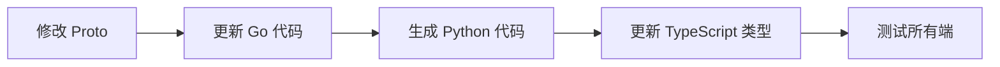

# 服务一致性检查

## 1. Proto 文件一致性

### Go ↔ Python Proto 同步检查

**检查点**：
- Proto 文件定义在 Go 端 (`link-go/api/proto/`)
- Python 通过 `scripts/generate_grpc.py` 同步生成代码
- 必须确保两端 proto 定义完全一致

```bash
# 检查 proto 文件是否存在
check_proto_consistency() {
    local proto_name=$1

    # Go 端 proto 文件
    local go_proto="link-go/api/proto/${proto_name}.proto"
    # Python 端生成的代码
    local python_proto="link-python/proto/${proto_name}_pb2.py"

    if [ ! -f "$go_proto" ]; then
        echo "❌ Proto 文件缺失: $go_proto"
        return 1
    fi

    if [ ! -f "$python_proto" ]; then
        echo "⚠️  Python proto 代码未生成，运行: python scripts/generate_grpc.py"
        return 1
    fi

    echo "✅ Proto 一致: $proto_name"
}
```

### Proto 版本号检查

```protobuf
// ✅ 正确 - 带版本号
syntax = "proto3";
package docreader;
option go_package = "link/api/proto/docreader;docreader";
option python_out = "link-python/proto";

// ❌ 错误 - 缺少版本信息
syntax = "proto3";
package docreader;
```

### 消息定义一致性

```bash
# 检查消息字段是否匹配
check_message_consistency() {
    # Go 结构体字段
    go_fields=$(grep -A 20 "message ParseRequest" link-go/api/proto/*.proto | grep "type" | wc -l)

    # Python 生成的字段
    python_fields=$(grep -A 20 "class ParseRequest" link-python/proto/*_pb2.py | grep -c "descriptor.FieldDescriptor")

    if [ "$go_fields" -ne "$python_fields" ]; then
        echo "❌ 消息字段数量不一致"
        return 1
    fi
}
```

## 2. API Contract 一致性

### REST API 路径一致

```bash
# 检查 Go handler 路径与前端 API 调用是否一致
check_api_path_consistency() {
    # Go 端定义的路径
    grep -r 'POST.*"/api/agents"' link-go/internal/handler/

    # 前端调用的路径
    grep -r 'fetch.*api/agents' link-web/src/

    # 检查是否匹配
    echo "检查 API 路径是否一致..."
}
```

### 数据模型一致

```typescript
// ✅ 正确 - TypeScript 类型与 Go 结构体一致
// Go:
// type Agent struct {
//     ID       string `json:"id"`
//     Name     string `json:"name"`
//     Type     string `json:"type"`
//     Config   string `json:"config"`
// }

interface Agent {
    id: string;
    name: string;
    type: string;
    config: string;
}

// ❌ 错误 - 字段名不匹配
interface Agent {
    agentId: string;  // 应该是 id
    agentName: string;  // 应该是 name
}
```

## 3. 状态码一致性

### HTTP 状态码约定

| 场景 | 状态码 | Go 端 | 前端处理 |
|------|--------|-------|----------|
| 成功 | 200 | `c.JSON(200, data)` | `if (response.ok)` |
| 创建 | 201 | `c.JSON(201, data)` | `if (response.status === 201)` |
| 参数错误 | 400 | `c.JSON(400, gin.H{"error": ...})` | 捕获并显示 |
| 未授权 | 401 | `c.JSON(401, ...)` | 跳转登录 |
| 未找到 | 404 | `c.JSON(404, ...)` | 显示 404 |
| 服务错误 | 500 | `c.JSON(500, ...)` | 显示错误 |

```go
// ✅ 正确 - 使用标准状态码
if err := validate(&req); err != nil {
    c.JSON(400, gin.H{"error": err.Error()})
    return
}

// ❌ 错误 - 返回 200 但包含错误
c.JSON(200, gin.H{"success": false, "error": err.Error()})
```

```typescript
// ✅ 正确 - 根据状态码处理
const response = await fetch(url);
if (!response.ok) {
    if (response.status === 401) {
        // 跳转登录
    }
    throw new ApiError(response.status, await response.json());
}
```

## 4. 枚举值一致性

### Go ↔ TypeScript 枚举

```go
// Go 端定义
type AgentType string

const (
    AgentTypeReAct   AgentType = "react"
    AgentTypeDeepResearch AgentType = "deep_research"
    AgentTypeCustom  AgentType = "custom"
)
```

```typescript
// ✅ 正确 - TypeScript 使用相同值
enum AgentType {
    ReAct = "react",
    DeepResearch = "deep_research",
    Custom = "custom"
}

// ❌ 错误 - 值不一致
enum AgentType {
    REACT = "REACT",  // 大写不匹配
    DEEP_RESEARCH = "deep-research"  // 短横线不匹配
}
```

### Python 枚举一致

```python
# Python 端
class AgentType(str, Enum):
    REACT = "react"
    DEEP_RESEARCH = "deep_research"
    CUSTOM = "custom"
```

## 5. 时间格式一致性

### 统一时间格式

| 字段 | 格式 | 示例 |
|------|------|------|
| created_at | RFC3339 | `2024-01-15T10:30:00Z` |
| updated_at | RFC3339 | `2024-01-15T10:30:00Z` |

```go
// ✅ 正确
type Entity struct {
    CreatedAt time.Time `json:"created_at"`
    UpdatedAt time.Time `json:"updated_at"`
}

func (e *Entity) MarshalJSON() ([]byte, error) {
    type Alias Entity
    return json.Marshal(&struct {
        CreatedAt string `json:"created_at"`
        UpdatedAt string `json:"updated_at"`
        *Alias
    }{
        CreatedAt: e.CreatedAt.Format(time.RFC3339),
        UpdatedAt: e.UpdatedAt.Format(time.RFC3339),
        Alias:     (*Alias)(e),
    })
}
```

## 6. 错误响应格式一致

### 统一错误响应结构

```json
{
    "error": {
        "code": "VALIDATION_ERROR",
        "message": "Invalid input",
        "details": {...}
    }
}
```

```go
// ✅ 正确 - 统一错误格式
type ErrorResponse struct {
    Error struct {
        Code    string `json:"code"`
        Message string `json:"message"`
        Details any    `json:"details,omitempty"`
    } `json:"error"`
}

func (h *Handler) handleError(c *gin.Context, err error) {
    var ve *ValidationError
    if errors.As(err, &ve) {
        c.JSON(400, ErrorResponse{Code: "VALIDATION_ERROR", Message: ve.Error()})
        return
    }
    c.JSON(500, ErrorResponse{Code: "INTERNAL_ERROR", Message: "Internal server error"})
}
```

## 7. 分页参数一致

### 统一分页请求

```json
{
    "page": 1,
    "page_size": 20
}
```

```json
{
    "data": [...],
    "total": 100,
    "page": 1,
    "page_size": 20
}
```

```go
// ✅ 正确
type PaginationRequest struct {
    Page     int `form:"page" binding:"min=1"`
    PageSize int `form:"page_size" binding:"min=1,max=100"`
}

type PaginationResponse struct {
    Data     any `json:"data"`
    Total    int64 `json:"total"`
    Page     int  `json:"page"`
    PageSize int  `json:"page_size"`
}
```

## 8. 自动化检查脚本

```bash
#!/bin/bash
# 服务一致性检查脚本

echo "🔍 检查服务一致性..."
echo "===================="

# 1. Proto 文件检查
echo "📦 [1/6] Proto 文件一致性"
for proto in docreader evaluation ml annotation; do
    check_proto_consistency "$proto"
done

# 2. API 路径检查
echo "🌐 [2/6] API 路径一致性"
# 检查 handler 路由定义
grep -rh 'POST\|GET\|PUT\|DELETE' link-go/internal/handler/ | grep -o '".*"' | sort > /tmp/go_routes.txt
# 检查前端 API 调用
grep -rh 'fetch.*api' link-web/src/ | grep -o "'/api/[^']*'" | sort > /tmp/web_apis.txt

# 3. 状态码检查
echo "📊 [3/6] HTTP 状态码一致性"
# 检查 handler 中是否使用非标准状态码
if grep -r 'c.JSON(200.*error' link-go/internal/handler/; then
    echo "❌ 错误: 200 状态码返回错误信息"
fi

# 4. 枚举值检查
echo "🏷️  [4/6] 枚举值一致性"
# 检查 Go 枚举定义
grep -rh 'const.*=.*"' link-go/internal/model/ | grep -E '(AgentType|TaskStatus)' | sort

# 5. 时间格式检查
echo "⏰ [5/6] 时间格式一致性"
# 检查 JSON 时间格式
if grep -r 'time.Time.*`json:"' link-go/internal/ | grep -v 'rfc3339'; then
    echo "⚠️  发现非 RFC3339 时间格式"
fi

# 6. 错误响应检查
echo "❌ [6/6] 错误响应格式一致性"
# 检查是否有统一的错误处理

echo "===================="
echo "✅ 服务一致性检查完成"
```

## 9. 常见不一致模式

### 不一致的命名

```go
// Go: snake_case JSON
type User struct {
    UserName string `json:"user_name"`
}
```

```typescript
// ❌ 错误 - 前端使用 camelCase
interface User {
    userName: string;  // 应该是 user_name 或使用转换器
}

// ✅ 正确 - 使用转换器或保持一致
interface User {
    user_name: string;
}
```

### 不一致的验证规则

```go
// Go 端: 最多 100 字符
func (u *User) Validate() error {
    if len(u.Name) > 100 {
        return errors.New("name too long")
    }
}
```

```typescript
// ❌ 错误 - 前端只限制 50 字符
const MAX_NAME_LENGTH = 50;

// ✅ 正确 - 与后端一致
const MAX_NAME_LENGTH = 100;
```

## 10. Proto 文件同步流程



```bash
# 同步步骤
1. 修改 link-go/api/proto/*.proto
2. 更新 Go 实现代码
3. 运行: cd link-python && python scripts/generate_grpc.py
4. 更新前端 TypeScript 类型
5. 运行测试验证一致性
```
