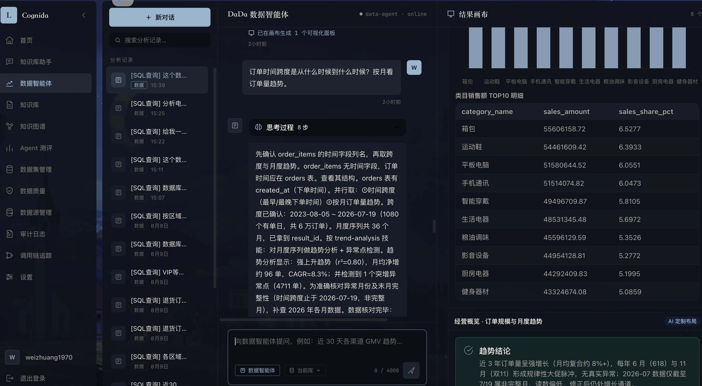
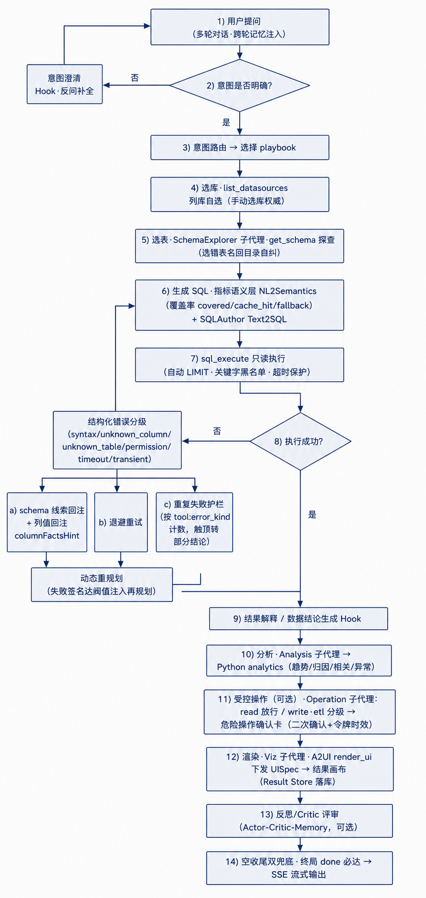
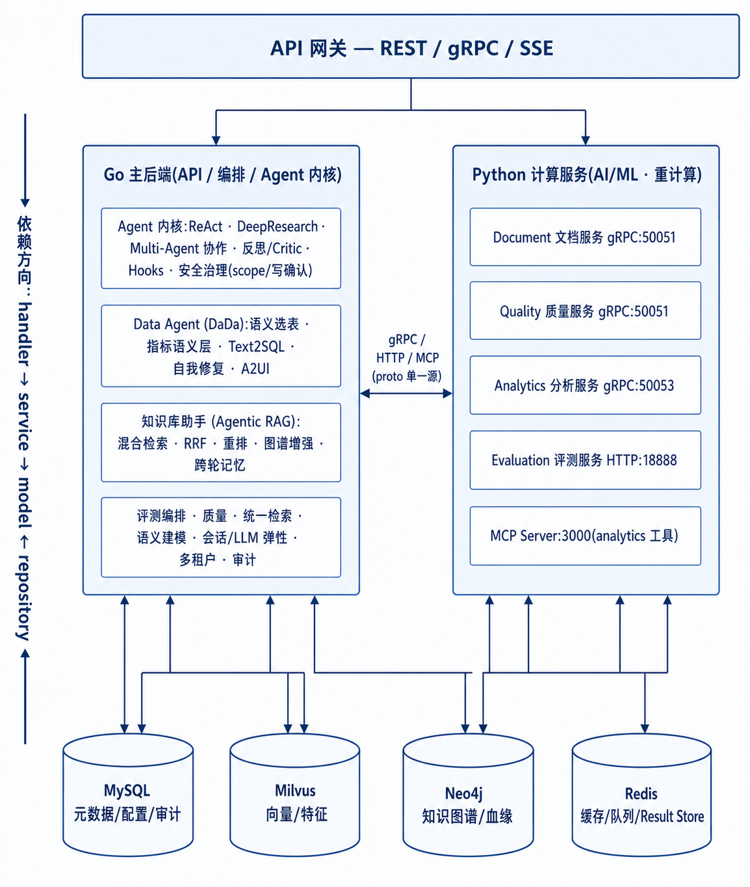

# Cognida

<div align="center">

**企业级 AI-Native 数据全链路平台**

以 Agent 为内生执行内核，覆盖「数据 + 知识」从接入、治理、沉淀、分析到评测、进化的全生命周期——受治理、可评测、可安全执行

[](https://golang.org/)
[](https://www.python.org/)
[](LICENSE)

</div>

---

## 界面预览

> **DaDa 数据智能体 · 结果画布**：左侧「思考过程」实时展开 ReAct 推理步骤，右侧 A2UI 生成式 UI 随流下发 UISpec，将图表 / 明细表 / 趋势结论实时绘制到结果画布。



---

## 项目简介

**Cognida** 是一个面向企业的 **AI-Native 数据全链路平台**——**不是"又一个能问数据的 Agent"**，而是把 Agent 作为**内生执行内核**、覆盖「数据 + 知识」从接入到进化整条链路的数据平台。采用 Go + Python 异构多服务架构。

### 名字的意义

**Cognida = Cognition（认知）+ Data（数据）**，词根取自拉丁语 *cognoscere*「去认识、去理解」、*cognitio*「认知 / 知识」。

- **Cogni-** 是"认知"的词根——不满足于"存起来、查得到"，而追求**理解、推理、沉淀、进化**；
- **-da** 既收束于 **Data（数据）**，也让整个词读起来像一个专有的名字，而非一串功能缩写。

一句话：Cognida 想做的不是"能被查询的数据"，而是**具备认知能力的数据与知识**——让数据自己会理解、会解释、会积累经验、会越用越好。这正对应了页尾那句 slogan：**Build Intelligence into Data & Knowledge**。

它以**一个企业级硬化的 Agent 内核**为引擎——口径受治理、操作可管控、过程可审计、质量可评测——但对外交付的是一个**平台**，在整条数据链路上统一承载：

- **结构化数据**的接入、查询、分析与安全操作
- **非结构化知识**的收集、沉淀、问答与溯源

目标不是做一个"会问答的 Agent"，而是让 Agent **内生驱动**数据与知识从「**进来**」到「**被用起来**」再到「**被评估改进**」的**全链路**——这就是 "AI-Native"：智能不是套在数据平台外面的问答壳，而是长在每个环节里。

### 系统定位

> Cognida 不是「又一个能问数据的 bot / Data Agent」。**BI / ChatBI** 只会查结构化数据、出图；**Data Agent（问数 / RAG 应用）** 只是个会查数据、答文档的"会调工具的对话体"——两者都停在"能不能答"这一层的**应用**。Cognida 定位在更底层：一个 **AI-Native 的数据全链路平台**——Agent 只是它的**执行内核**，产品是覆盖数据/知识**从收集、治理、沉淀、分析到评测、进化**整条链路、且"答之后还能被验证"的平台底座。

一句话记忆点：

> **别人做的是「能问数据的助手 / Agent 应用」；Cognida 做的是「以 Agent 为内核、把数据与知识全链路做成 AI-Native 的企业级数据平台——敢托付、可评测、能进化」。**

### 核心差异

| | BI / ChatBI | Data Agent（问数 / RAG 应用） | 数据中台 | **Cognida** |
|---|--------|-----------|---------|----------|
| **形态** | 应用 | 应用 | 平台（非 AI-Native） | **平台 + AI-Native 内核** |
| 结构化数据 | ✅ | ✅ | ✅(底座) | ✅ |
| 非结构化知识 | ✗ | ✅ | 部分 | ✅ |
| 口径受治理(可信 SQL) | 部分 | ✗ | 部分 | ✅ |
| 可安全执行(读/写/ETL 分级) | ✗ | ✗ | ✗ | ✅ |
| 可评测(轨迹级度量) | ✗ | ✗ | ✗ | ✅ |
| 全过程可审计 | 部分 | ✗ | 部分 | ✅ |
| AI-Native 全链路（收集→进化，Agent 内生驱动） | ✗ | ✗ | ✗ | ✅(建设中) |

> 说明：**BI / Data Agent 都是"应用"**（停在能不能答），**数据中台是"平台但非 AI-Native"**（智能靠外挂）。Cognida 把两者合一——**平台形态 + AI-Native 内核**；其内置的 Data Agent（DaDa）只是这个平台的**一个执行面**，而非产品本身。

**护城河 = 三者的交集：企业级硬化的 Agent 内核 × 数据/知识双栖 × 全生命周期覆盖。** 单看每一格都是商品，叠加起来才是"组织敢长期托付、还能持续进化"的 **AI-Native 数据全链路平台**。

---

## 能力全景（数据/知识 × 全生命周期）

作为一个平台，Cognida 的每一项能力都落在一张网上：横轴是**平台以 Agent 内核驱动的数据/知识全生命周期**，纵轴是**处理对象**。✅ 已实现 · 🚧 规划中。

| 生命周期 → | ①收集/接入 | ②清洗/达标 | ③沉淀/资产化 | ④分析/决策 | ⑤评测/进化 |
|-----------|-----------|-----------|-------------|-----------|-----------|
| **结构化数据** | 多数据源接入 ✅<br>数仓接入分析 🚧<br>Agent 自动收集 🚧 | 数据质量中心 ✅<br>数据清洗 ✅<br>数据达标(自动+人工) 🚧 | 指标语义层(治理口径) ✅<br>Result Store ✅<br>数据特征化(自动) 🚧<br>特征存储 🚧 | Data Agent(DaDa) ✅<br>Text2SQL(内核内) ✅<br>自我修复(错误分级/schema 引导/列值回注/失败护栏/重规划) ✅<br>数仓分析 🚧<br>A2UI 生成式 UI ✅ | 轨迹级 Agent 评测 ✅<br>Text2SQL/SQL 评测 ✅<br>Agent 自进化/经验沉淀(默认关) ✅<br>数据漂移检测 🚧<br>进化回路(评测反哺) 🚧 |
| **非结构化知识** | 知识库上传(多格式/委派 OCR) ✅<br>Agent 自动收集 🚧 | 非结构化质量评估 ✅<br>上传去重 ✅<br>数据标注/达标 🚧 | 知识库/智能分块/向量化 ✅<br>知识图谱抽取 ✅<br>跨轮对话记忆 ✅<br>长期记忆(接口预留) 🚧 | 知识库助手(Agentic RAG) ✅<br>图谱检索/多跳 ✅<br>DeepResearch(简化版) ✅ | RAG 评测(faithfulness 等) ✅<br>检索/生成指标 ✅ |
| **贯穿层（两者共用）** | \ | Agent 内核(ReAct / DeepResearch / 多 Agent 协作 / 编排 / 反思 / Hooks)、安全与治理(scope 门控/写确认/只读加固)、LLM 统一弹性、多租户 RBAC、审计 + request_id + Loki 可观测、Skill/MCP 扩展 | | | / |

> **诚实标注**：结构化侧的「①自动收集」「③特征化」是当前主要的"洞"。⑤的**经验沉淀链路已接线但默认关**（会话蒸馏为唯一进化通道，写侧/读侧/SKILL 落地各自独立门控），真正缺的是「**评测结论自动反哺收集/沉淀策略**」这段回路——把已有工位之间的传送带接上、并默认打开，这个环才算真正**自己转起来**。

### 已实现能力速览 ✅

- **Agent 内核**：ReAct 编排 · 上下文三级压缩 · Multi-Agent 协作 · 反思 / Hooks · SSE 流式
- **Data Agent（DaDa）**：语义选表 · 指标语义层 · Text2SQL · 自我修复 · A2UI 生成式 UI
- **知识侧**：混合检索（RRF + 重排）· 知识图谱多跳 · Agentic RAG · 跨轮记忆 · DeepResearch（简化版）
- **质量 / 评测**：数据质量中心 · QA / RAG / Agent / Text2SQL 四类评测（含轨迹级）
- **底座**：多租户 RBAC · request_id + 审计 + Loki · LLM 统一弹性 · Skill / MCP · Docker 一键部署
- **自进化**：会话经验蒸馏 → SKILL / 图谱 / 经验库（已接线，默认关）

> 尚未接通的能力（自动收集 / 数仓分析 / 数据达标 / 特征化 / 进化回路 …）统一收敛到文末的 **[规划中 🚧](#规划中-)** 与 **[路线图](#路线图)**。

---

## 已实现功能 ✅

### Agent 内核

下图是 **Data Agent（DaDa）的全流程**——单一 ReAct 内核（推理 → 行动 → 观察）如何驱动「取数 → 自我修复 → 分析 → 受控操作 → 渲染 → 反思」的完整闭环：



- **ReAct 编排**：推理-行动循环，统一 Eino Tool 框架
- **上下文工程**：三级压缩（① 单条 >32k 就地压缩 · ② 全对话累计 ≥128k 折叠回 ~64k，按整轮折叠保 tool 配对，A 级观测遮蔽 + B 级摘要 · ③ 陈旧推理驱逐 16k），配套 `bpecount` 真实 BPE 计数（内嵌 DeepSeek-V3 tokenizer，`//go:embed`）而非字符估算
- **DeepResearch**：深度研究模式，多步推理生成结构化报告（**简化版**，多源引用/验证规划中）
- **Multi-Agent 协作**：任务分解、智能分发、结果聚合；委托含「上下文防火墙」+ 委托轨迹穿透（供评测/审计）
- **编排原语**：Sequential / Parallel / Loop / Conditional / Supervisor
- **反思 / 评审（critic）**：可插拔 LLM / 规则评审子系统（Actor-Critic-Memory），按 Agent 配置启用
- **Agent Hooks**：数据结论生成、意图澄清、反思、自我修正护栏、guardrail、工具策略（按预设装配）
- **流式响应**：SSE 实时输出，结论/图表边推理边下发
- **Agent 自进化（经验沉淀，默认关）**：后台异步、不阻塞对话——**会话经验蒸馏**：空闲会话经 LLM 蒸馏为 SKILL.md + 知识图谱 + 经验库，图谱召回在首答注入历史经验；写侧 `EXPERIENCE_DISTILL_ENABLED`、读侧 `EXPERIENCE_RECALL_ENABLED`、SKILL 落地 `EXPERIENCE_SKILL_SINK_ENABLED` 各自独立（均默认关），非 LLM 客观失败门 `EXPERIENCE_PREGATE_ENABLED` 默认开

### 结构化数据：查询 · 分析 · 安全操作

- **Data Agent（DaDa）**：单一 ReAct 内核驱动的 取数 → 分析 → 渲染 → 操作 闭环，意图路由 → playbook，分层子代理委派（SchemaExplorer / SQLAuthor / Analysis / Operation / Viz 叶子 + Insight / Report 编排器）
- **Text2SQL**：**运行在 Data Agent ReAct 内核内**（`get_schema` + `sql_execute` + `semantic_query` 工具循环 + 下述自我修复），而非独立的 Plan-Execute-Reflect 智能体；Schema 感知、多轮对话、结果解释
- **指标语义层（NL2Semantics）**：在 LLM 与数仓之间引入受治理的指标语义层，把「裸写 SQL」升级为「按中心化口径生成 SQL」，附覆盖率统计（covered / cache_hit / fallback）
- **多数据源接入**：MySQL / PostgreSQL，凭据 AES-256-GCM 加密、连接池、健康检查、`information_schema` 内省，外部源视为**只读外部资源**
- **A2UI 生成式 UI**：`render_ui` 随流下发 UISpec，图表/表格/结论实时绘制到结果画布；Result Store 中间结果落库、会话重开恢复画布
- **安全执行**：会话按 `read / write / etl` 分级，写操作走危险操作确认卡（二次确认 + 令牌时效）；查询默认只读、自动 LIMIT、关键字黑名单、超时保护
- **自我修复（业务层闭环）**：SQL/取数报错时不止于重试——① **结构化错误分级**（`syntax / unknown_column / unknown_table / permission / timeout / transient`，按 MySQL 错误码，`sql_error.go` `classifySQLError`）；② **schema 线索回注**（列不存在回传该表可用列、表不存在回传近似候选表，经 `information_schema` 现取，`buildSchemaHint`；并对枚举/取值列回注真实取值 `columnFactsHint`）；③ **重复失败护栏**（按 `tool:error_kind` 计数，触顶提前收尾并转部分结论，`self_repair_guard.go`，防无限失败循环）；④ **动态重规划**（同一失败签名达阈值注入再规划提示，引导换路径而非原样重试）

### 非结构化知识：检索 · 图谱 · 记忆

- **统一检索能力（`RetrievalCapability`）**：Agent 工具与 REST 接口同源——Milvus 语义向量 + BM25 全文双路召回，RRF 融合、可插拔重排精排、按知识库有界并发扇出（上限 8）；`kb_fetch_chunks` 支持定位原文片段。HyDE / 查询重写 / 多跳仅作为**独立 REST 优化器端点**提供，尚未做成 Agent 内可组合工具
- **知识库范围强制**：范围经会话入口选定并由 ctx 强制透传，工具层求交拒绝越权
- **知识图谱**：文档入库时 LLM 并发抽取实体关系三元组，Neo4j 存储；图谱检索支撑关系/关联/溯源类问答；图谱提取=库级开关、检索=提问级开关；一键补建、图谱管理与可视化
- **知识库管理**：PDF / Word / Excel / Markdown / TXT，智能分块、向量化、OCR（委派 Python 文档服务，默认 `ExtractImages:false`）、按 file hash 去重预检
- **跨轮对话记忆**：会话内多轮消息回放注入（`model/memory` 仅定义长期记忆/偏好接口，暂无落地实现）

### 质量 · 评测（可信与度量）

- **数据质量中心**：完整性 / 一致性 / 准确性 / 有效性 / 唯一性 / 时效性打分（维度由 Python 动态返回）；非结构化质量（可读性/信息密度/语言质量 + PII 检测）；数据清洗（去噪/去重/格式转换）。Go 端为薄代理，实际计算委派 Python gRPC（数据漂移检测规划中）
- **评测子系统**：QA / RAG / Agent / **Text2SQL(SQL)** 四类评测，**Go 编排/执行/存储，Python 计算打分**，grader 注册表为单一事实源
  - 检索指标：Recall@K、Precision@K、MRR、NDCG、MAP
  - 生成指标：BLEU、ROUGE、语义相似度
  - RAG 专项：faithfulness、context_relevance、noise_ratio
  - **Agent 轨迹级**：答案准确性、工具选择、工具顺序、轨迹匹配、步骤效率
  - **Text2SQL/SQL**：`sql_exact_match`、`sql_component_match`、`sql_execution_accuracy`（Go 只读执行金标准 + 生成两条 SQL，Python 无序比对结果集；SQL 评测自动剔除 ROUGE/BLEU 生成类评分器）
  - 规则类：exact / contains / regex / numeric
  - LLM-as-a-Judge：多维裁判（事实正确性、内容安全性等）
  - 独立 FastAPI 评测服务（默认 :18888），前端指标可视化配置与结果明细一体化

### 平台底座

- **多租户**：数据与权限隔离、RBAC（`model/user/rbac`）、用户管理
- **可观测性**：request_id 全链路透传、结构化审计（audit_logs）、Loki 日志采集，同 rid 关联
- **LLM 统一弹性**：跨目标有序降级链 + 同目标指数退避重试（全抖动）+ per-target 三态熔断，透明装饰、成功路径零改动；eino 化 `LLMClient`（`eino_client.go`）承接 OpenAI 兼容 Provider，DeepSeek 原生 `<｜｜DSML｜｜tool_calls>` 由 `chat/dsml.go` 解析回结构化工具调用
- **Skill 系统**：Agent 本地精选 skill/playbook 注册表，`skill_invoke` / `skill_list` + SKILL.md 目录（渐进式披露）
- **Python 数据分析工具（MCP）**：经 MCP 通道调用 Python `analytics`（趋势/归因/相关/异常等），缓存 + 指数退避重连 + 健康检查

---

## 技术架构

平台以 Go 主后端为承载、Agent 内核为引擎，Python 负责重计算，四类存储各司其职——Agent 是**长在平台里的执行内核**，而非独立部署的一个 bot。



**依赖方向**：`handler → service → model ← repository`

### 存储约定

| 存储 | 用途 |
|------|------|
| MySQL | 元数据、配置、任务状态、语义模型、评测结果、审计日志 |
| Milvus | 知识库向量、检索特征 |
| Neo4j | 知识图谱、实体关系、经验图谱、血缘 |
| Redis | 缓存、任务队列、进度、Result Store、分布式锁 |

---

## 服务通信

### Go → Python

| 方式 | 端口 | Python 服务 | 状态 | 用途 |
|------|------|------------|------|------|
| gRPC | 50051 | Document Service | ✅ | 文档解析、OCR、分块、URL 抓取 |
| gRPC | 50051 | Quality Service | ✅ | 质量检查、数据清洗 |
| gRPC | 50053 | Analytics Service | ✅ | 趋势、洞察、统计、归因 |
| HTTP | 18888 | Evaluation Service | ✅ | 评测计算（compute-metrics，无状态） |
| HTTP | 8000 | 基础 HTTP 服务 | ✅ | Python `main.py` 基础接口 |
| MCP  | 3000（本地 3100） | Analytics 工具通道 | ✅ | Agent 经 MCP 调用 Python 数据分析能力 |
| gRPC | 50054 | ML / 特征化 Service | 🚧 | 特征抽取、模型推理 |
| gRPC | 50055 | 数据收集 / 达标 Service | 🚧 | 自动收集、标注达标 |

- **Proto 单一数据源**：仓库根 `proto/*.proto`（buf 管理，`buf.yaml` / `buf.gen.yaml` 在根目录），Go / Python 各自生成绑定
- **MCP**：JSON-RPC 2.0 over HTTP/stdio；Go 端 `internal/infrastructure/mcp`（客户端），Python 端 `services/cognida-python/mcp_service`（服务端，默认端口 3000，本地占用改用 3100）

---

## 应用场景

### 能力 → 场景对照

| 场景 | 说明 | Cognida 能力 |
|------|------|----------|
| **可信智能分析** | 自然语言查数，口径受治理、结果可审计、直接出图 | Data Agent · 语义层 · A2UI ✅ |
| **深度研究分析** | 复杂问题多步推理，生成结构化报告 | DeepResearch（简化版） ✅ |
| **知识问答与溯源** | 企业知识沉淀、检索、关系溯源 | Agentic RAG · 知识图谱 ✅ |
| **数据驱动决策** | 基于分析输出可落地行动建议 | Agent 决策 · 结论生成 ✅ |
| **自动数据沉淀** | Agent 自动收集、达标、沉淀为知识与数据集 | 收集 Agent · 达标 · 特征化 🚧 |

### 能落地的具体场景

Cognida 的价值在"数据 + 知识 + 受治理执行 + 可评测"叠加时才显现。下面是几个可以真实跑起来的落地样例——绝大多数依赖的能力今天已 ✅，标 🚧 的部分是当前的洞（也正是欢迎参与的地方）。

- **📊 经营分析 / 智能 BI 替身**
  业务负责人用大白话问「上月各区域毛利环比、掉得最狠的三个 SKU 是什么」，Agent 走**指标语义层**按中心化口径生成 SQL、只读执行、A2UI 直接画出图表与结论，全过程留 `request_id` 审计。相比传统 ChatBI，多了**口径治理**（不会各人各口径）和**结果可审计**（能追责、能复盘）。

- **📚 企业知识助手 / 制度问答与溯源**
  把制度、SOP、合同、产品手册灌进知识库，员工问「XX 报销标准是多少、依据哪条」，Agentic RAG 混合检索 + 重排给出答案并**定位到原文片段**；涉及"谁签了这份合同、关联哪个项目"这类关系型问题，走**知识图谱多跳**溯源。知识库范围按会话强制隔离，越权访问在工具层被拒。

- **🔍 尽调 / 竞品 / 市场深研报告**
  给一个宽泛课题（如"某赛道近一年格局变化"），DeepResearch 多步推理产出结构化报告（当前为**简化版**，多源引用与交叉验证 🚧）。适合投研、战略、市场做初稿。

- **⚠️ 风险 / 异常运营洞察**
  「哪些客户有流失风险、为什么、怎么挽回」——Agent 经 MCP 调 Python analytics 做趋势/归因/异常检测，再由结论 Hook 生成可落地的行动建议，而不止于甩一张表。

- **🛡️ 受管控的数据操作（读 / 写 / ETL 分级）**
  面向"不只是查、还要改"的场景（批量订正、打标、清洗入仓）：会话按 `read/write/etl` 分级，写操作强制走**危险操作二次确认卡 + 令牌时效**，查询默认只读、自动 LIMIT、关键字黑名单。让企业敢把"会动数据"的能力交给 Agent。

- **🧪 Agent / RAG / Text2SQL 质量评测平台**
  团队自研了 AI 问数或 RAG 应用，需要客观回归："这次改 prompt 到底变好还是变坏了？" 用内置评测子系统跑**轨迹级 Agent 评测 / RAG faithfulness / Text2SQL 执行准确率**，把"感觉变好了"变成可度量的分数与明细。这一块可以**独立于主业务单独使用**。

- **🧩 数据 + 知识联合问答（双栖场景）**
  真正区别于"只会查库的 bot"或"只会答文档的 RAG"的场景：一个问题同时需要**结构化事实**（订单量、金额）和**非结构化背景**（合同条款、政策说明），Cognida 在同一个 Agent 内核里把两栖数据一起用起来。

- **🔄 自主进化的数据工位（愿景 🚧）**
  终态目标：Agent 自动收集 → 达标 → 沉淀 → 分析 → 评测 → **把评测结论反哺收集/沉淀策略**，让整条流水线自己越转越好。今天各工位大多已 ✅、经验蒸馏链路已接线（默认关），**缺的是评测反哺那段回路**——见「规划中 🚧」。

> 适用行业不限：零售/电商（经营分析、流失预警）、金融/投研（尽调、风控、合规问答）、制造/供应链（质量与异常）、SaaS/互联网（增长归因、AI 应用评测）等，凡是"既有库表数据、又有文档知识，且对口径与可审计有要求"的组织都能对号入座。

### 用户角色

| 角色 | 典型问题 |
|------|---------|
| **管理层** | "本月业务健康度如何？有什么需要关注？" |
| **业务分析** | "分析 A 渠道 ROI 下降的原因" |
| **业务运营** | "哪些客户有流失风险？给出挽回建议" |
| **IT/数据** | "报表 X 的数据来源是哪里？口径对不对？" |

---

## 能力分级

| 级别 | 定义 | 状态 |
|------|------|------|
| **L1** | 模板化输出：按预设模板生成图表报表 | ✅ |
| **L2** | 自然语言交互：对话式输出分析结论 | ✅ |
| **L3** | 主动决策：拆解任务、规划路径、验证结果、输出行动建议 | 🚧 演进中（Data Agent 已落地）|
| **L4** | 自主进化：自动收集→达标→沉淀→分析→评测→反哺的闭环自转 | 🚧 建设中 |

---

## 项目结构

```
cognida/
├── services/
│   ├── cognida-go/               # Go 主后端（API / 编排 / Agent / RAG / 图谱 / 语义 / 评测编排）
│   │   ├── cmd/                  # 可执行入口：server / migrate-db / seed-*（演示与冷启动灌数）
│   │   ├── internal/
│   │   │   ├── handler/          # HTTP handlers（依赖方向：handler → service → model ← repository）
│   │   │   ├── service/          # 业务逻辑：agent / knowledge / semantic / evaluation / quality …
│   │   │   ├── repository/       # 数据访问实现（MySQL / Milvus / Neo4j / Redis）
│   │   │   ├── model/            # 实体与接口定义
│   │   │   ├── infrastructure/   # 基础设施：llm / mcp / cache / graph / auth / config …
│   │   │   ├── wire/             # 依赖注入装配（google/wire 组合根）
│   │   │   └── prompt/           # 提示词配置（//go:embed 打包）
│   │   ├── migrations/           # golang-migrate 版本化迁移（业务表结构唯一真源）
│   │   ├── skills/               # Agent Skill 定义（SKILL.md，运行时按 ./skills 加载）
│   │   ├── api/ · scripts/ · examples/
│   │   └── go.mod
│   └── cognida-python/           # Python 计算服务（文档解析 / 评测 / 质量 / analytics）
│       ├── grpc_service/ · mcp_service/    # gRPC 服务端 + MCP 服务端
│       ├── services/ · core/ · plugins/    # 业务逻辑 / 内核 / 插件
│       ├── api/ · tools/ · tests/
│       └── main.py · pyproject.toml
├── apps/
│   └── cognida-web/              # Vue 3 前端（Vite）：src / public / docs
├── proto/                        # gRPC 契约（buf 管理，单一数据源）
├── deploy/                       # 部署与日志采集（Loki 等）
├── .github/                      # CI（含 gitleaks 安全扫描门）
├── buf.yaml · buf.gen.yaml       # buf 代码生成配置
└── dev.sh                        # 本地一键起停脚本
```

---

## 快速开始

### 环境要求

- **Go** 1.25+ · **Python** 3.11+（uv）· **Node** 18+ · **MySQL** 8.0+ · **Milvus** 2.6+ · **Neo4j** 5.0+ · **Redis** 7.0+
- **本机开发模式**：中间件（MySQL / Redis / Neo4j / Milvus）需**预先常驻**（本机以 Homebrew services 管理 MySQL/Redis/Neo4j，Milvus 跑在 docker 容器），应用层用下方 `dev.sh` 启动。
- **容器一体化模式**：仓库根目录已提供 [`docker-compose.yml`](docker-compose.yml)，一条命令拉起**全部组件与服务**（前端 + Go + Python + MySQL/Milvus(+etcd+minio)/Neo4j/Redis），无需本机预装任何中间件，见下方「Docker 一键部署」。

### 配置参数

**配置分两层**：非密配置（端口 / 模型名 / base_url / 超时 / 开关…）是**入库真源**，密钥（密码 / Token / API Key）**只走环境变量 `.env`，绝不入库**。加载优先级从低到高：**代码内兜底默认 < `config.yaml` < 环境变量 / `.env`（覆盖，且是密钥唯一来源）**。

| 服务 | 非密真源（入库） | 密钥来源（复制 `.env.example` → `.env`，已 gitignore） |
|------|---------|------|
| Go 后端 | `internal/config/config.yaml`（`//go:embed` 编译期打包进二进制） | `services/cognida-go/.env` |
| Python | `services/cognida-python/config/config.yaml` | `services/cognida-python/.env` |
| 前端 | — | `apps/cognida-web/.env.development`（`VITE_API_BASE_URL`） |

> **Docker 模式更省事**：只需在**仓库根目录一个 `.env`**（`cp .env.docker.example .env`）填全部密钥，compose 会注入到各容器，无需再改服务内的 `.env`。

**必填 / 常用密钥**（缺失则对应能力不可用；`JWT_SECRET` 缺失或不足 32 字节会**直接启动失败**，fail-closed）：

| 变量 | 用途 | 获取 / 生成 |
|------|------|------|
| `JWT_SECRET` | 登录令牌签名 | `openssl rand -hex 32` |
| `DB_PASSWORD` · `NEO4J_PASSWORD` | MySQL / Neo4j 密码 | 自定义 |
| `CHAT_API_KEY` | 聊天大模型（Go 侧，默认 DeepSeek） | 模型厂商控制台 |
| `EMBEDDING_API_KEY` | 向量化（默认阿里云 DashScope） | 阿里云百炼 |
| `LLM_API_KEY` | Python 侧 LLM（文档 / 评测 / 质量） | 模型厂商控制台 |
| `DATASOURCE_SECRET_KEY` | 外部数据源密码 AES-256 加密（多数据源必需） | `openssl rand -base64 32` |
| `METASO_API_KEY` | 联网搜索（DeepResearch，可选） | Metaso |
| `MILVUS_TOKEN` · `REDIS_PASSWORD` | 云 Milvus / 带密 Redis（本机可留空） | 按需 |

**切换模型 / Provider**（改非密 `config.yaml`，Key 仍走 `.env`）：默认聊天模型 `deepseek-chat`（`chat.base_url: https://api.deepseek.com/v1`），Embedding `text-embedding-v3`（DashScope）。换成 OpenAI 或其它 OpenAI 兼容服务，只需改 `chat.base_url` / `chat.model_name` / `chat.provider`，Key 填到 `CHAT_API_KEY` 即可——LLM 统一弹性层承接任意 OpenAI 兼容 Provider。

### Docker 一键部署（全组件）

`docker-compose.yml` 编排全部基础设施与三个应用服务，数据库迁移由一次性 `cognida-migrate` 服务在 Go 启动前跑完（golang-migrate 版本化迁移，不自动建表）。

```bash
git clone https://github.com/your-org/cognida.git && cd cognida

cp .env.docker.example .env      # 填入密钥：DB_PASSWORD / NEO4J_PASSWORD / JWT_SECRET / 各 API Key
docker compose up -d --build     # 首次构建 + 拉起全部服务
docker compose ps                # 查看健康状态
docker compose logs -f cognida-go
docker compose down              # 停止（加 -v 连同数据卷一起清空）
```

访问：前端 `http://localhost:8888` ｜ Go API `http://localhost:8080/api/v1` ｜ Neo4j Browser `http://localhost:7474`。
前端经 nginx 同源反代 `/api → cognida-go:8080`（含 SSE 关缓冲），无需额外配置 CORS。

### 一键启动（本机开发，推荐）

`dev.sh` 是真实的一键启动脚本，负责启停 Go 后端 + 4 个 Python 服务 + 前端，并对中间件做连通性预检。

```bash
git clone https://github.com/your-org/cognida.git
cd cognida

# 先确保中间件在跑（示例：Homebrew + docker）
brew services start mysql@8.0 redis neo4j && docker start milvus-standalone

./dev.sh start      # 启动全部服务
./dev.sh status     # 查看状态
./dev.sh logs go    # 跟踪某个服务日志
./dev.sh stop       # 停止全部服务
```

### 手动分服务启动

```bash
# 1. Go 后端（:8080）
cd services/cognida-go && go run ./cmd/server

# 2. Python 服务（uv）
cd services/cognida-python
uv run python -m grpc_service.server                                   # gRPC 50051(+Analytics 50053)
uv run python main.py                                                  # 基础 HTTP :8000
uv run uvicorn services.evaluation.fastapi_app:app --port 18888        # 评测 :18888
MCP_MODE=http uv run python -m mcp_service.server                      # MCP :3000（本机 MCP_PORT=3100）

# 3. 前端（:5173）
cd apps/cognida-web && npm install && npm run dev
```

| 服务 | 端口 | 说明 |
|------|------|------|
| cognida-go（后端） | 8080 | REST / gRPC / SSE 网关 |
| cognida-python gRPC | 50051 / 50053 | Document+Quality / Analytics |
| cognida-python 基础 HTTP | 8000 | `main.py` 基础接口 |
| cognida-python 评测 | 18888 | FastAPI 评测计算 |
| cognida-python MCP | 3000（本机 3100） | HTTP 模式 MCP |
| cognida-web（前端） | 5173 | Vite 开发服务器（strictPort，代理 /api→:8080） |

> **数据库表结构**：业务表由**版本化迁移**（golang-migrate）管理，运行时**不自动建表**。首次启动（或改 schema 后）需先跑一次迁移——Docker 模式由一次性 `cognida-migrate` 服务在 Go 启动前自动完成；本机 / 手动模式执行：
> ```bash
> cd services/cognida-go && set -a && source .env && set +a && go run ./cmd/migrate-db up
> ```

**调用链路**：浏览器(:5173) → Go 后端(:8080) → gRPC/HTTP/MCP → Python 服务

---

## 规划中 🚧

> 以下均为**尚未落地**的能力，围绕"把生命周期闭环接通"展开，而非无限加功能。前面章节只列已跑通的能力，未完成项统一收敛在这里与下方「路线图」。

| 模块 | 能力 | 落在生命周期 | 优先级 |
|------|------|-------------|--------|
| **Agent 自动收集数据** | Agent 主动从 Web / API / 文件 / 库表发现并采集数据、自动沉淀为知识与数据集 | ①收集/接入 | P1 |
| **数仓分析** | 接入并分析主流数仓（ClickHouse / Doris / StarRocks / Hive / BigQuery 等），作为**消费方**而非自建数仓 | ①接入 + ④分析 | P1 |
| **数据达标（自动 + 人工）** | 自动清洗 + 人工标注/校准的 human-in-the-loop 达标流程，让入库数据可信可用 | ②清洗/达标 | P1 |
| **数据特征化（自动）** | 从达标数据自动抽取特征、沉淀为可复用的特征资产（对接特征存储） | ③沉淀/资产化 | P2 |
| **特征存储** | 离线特征宽表（元数据 + 向量特征），供分析与预测复用 | ③沉淀/资产化 | P2 |
| **进化回路** | 评测结论自动反哺收集/沉淀策略，让"自主进化"从能力变成回路 | ⑤评测/进化 | P2 |
| **检索优化器 Agent 化** | HyDE / 查询重写 / 多跳从独立 REST 端点做成 Agent 内可组合工具 | ④分析/决策 | P2 |
| **长期记忆落地** | `model/memory` 接口已定义，补上跨会话长期记忆/偏好的落地实现 | ③沉淀/资产化 | P2 |
| **Agentic RL** | Agent 强化学习、自主优化、策略迭代 | ⑤评测/进化 | P2 |
| **AI 原生能力** | 数据自描述、自适应处理、模型-数据闭环、自主学习 | 全生命周期 | P3 |

> **设计原则**：一个能力要落在"数据/知识 × 生命周期"这张网上、且能和相邻工位交换产物，才值得做；落不上、不交换的，就是负债。先让一小段环端到端跑通（收集 → 达标 → 沉淀 → 分析 → 评测 → 反哺），再加宽。

---

## 路线图

> 已交付的不是"一个 Agent"，而是**一个平台的多块能力**——底座、Agent 内核、结构化数据智能、非结构化知识、质量评测都已并行建成（阶段一～六 ✅，是平台的不同板块而非严格先后）。阶段七起，是把这些工位"接成闭环"的前瞻路线 🚧。

### 阶段一：平台底座 ✅

- [x] 多租户 RBAC · 用户 / 租户数据与权限隔离
- [x] 可观测性：request_id 全链路 + 结构化审计（audit_logs）+ Loki 同 rid 关联
- [x] LLM 统一弹性：有序降级链 + 全抖动退避重试 + per-target 三态熔断（eino 化 `LLMClient`）
- [x] 异构服务通信（gRPC / HTTP / MCP，proto 单一源）· Docker 一键部署 + golang-migrate 版本化迁移

### 阶段二：Agent 内核 ✅

- [x] ReAct 编排 · 上下文三级压缩（内嵌真实 BPE 计数）· SSE 流式
- [x] Multi-Agent 协作（上下文防火墙 + 委托轨迹穿透）· 编排原语（Sequential / Parallel / Loop / Conditional / Supervisor）
- [x] 反思 / Critic（Actor-Critic-Memory）· Agent Hooks（意图澄清 / 会话洞察 / 结论生成 / guardrail）· DeepResearch（简化版）
- [x] Skill 系统（`skill_invoke` / `skill_list` + SKILL.md）· Python 数据分析工具（MCP）

### 阶段三：结构化数据智能 ✅

- [x] Data Agent（DaDa，单一 ReAct 内核）· 意图路由 → playbook · 分层子代理委派
- [x] Text2SQL（内核内）· 自我修复（错误分级 / schema 引导 / 列值回注 / 失败护栏 / 动态重规划）
- [x] 指标语义层（NL2Semantics，治理口径 + 覆盖率统计）· 外部多数据源接入（AES-256-GCM 加密，只读）
- [x] A2UI 生成式 UI + Result Store · 安全执行（read / write / etl 分级 + 危险操作确认卡）

### 阶段四：非结构化知识 ✅

- [x] 统一检索能力（Milvus 向量 + BM25 全文 + RRF 融合 + 可插拔重排，按库有界并发）
- [x] 知识库管理（PDF / Word / Excel / MD / TXT + 委派 OCR + 智能分块 + 向量化 + hash 去重）
- [x] 知识图谱（LLM 并发抽取三元组 → Neo4j，多跳检索 / 溯源 + 一键补建 + 可视化）
- [x] 知识库范围强制隔离 · 跨轮对话记忆

### 阶段五：质量与评测 ✅

- [x] 数据质量中心（6 维打分 + 非结构化质量 / PII + 数据清洗，Go 薄代理 + Python 计算）
- [x] 评测子系统（QA / RAG / Agent / Text2SQL 四类，Go 编排执行存储 + Python 打分）
- [x] 指标全套：检索 / 生成 / RAG faithfulness / Agent 轨迹级 / SQL 执行准确率 + LLM-as-Judge
- [x] 独立 FastAPI 评测服务（:18888，可脱离主业务单独使用）

### 阶段六：自进化（雏形）✅ / 🚧

- [x] 会话经验蒸馏（SKILL.md / 图谱 / 经验库），后台异步、默认关
- [x] 两套自进化链路收敛为一套（退役反思异步链路，统一到会话经验蒸馏）
- [ ] **进化回路**：把评测结论自动反哺收集 / 沉淀策略（当前缺的一段），并默认打开

### 阶段七：数据 / 知识生命周期接通 🚧

- [ ] **Agent 自动收集数据**（Web / API / 文件 / 库表 → 自动沉淀）
- [ ] **数仓分析**（接入并分析 ClickHouse / Doris / StarRocks / Hive / BigQuery）
- [ ] **数据达标**（自动清洗 + 人工标注 / 校准，human-in-the-loop）
- [ ] **数据特征化（自动）** + 特征存储

### 阶段八：自主进化闭环 🚧

- [ ] Agentic RL（Agent 强化学习、自主优化、策略迭代）
- [ ] 数据自描述 · 自适应处理 · 模型-数据闭环 · 自主学习

---

## 开发规范

- [全局开发规范](CLAUDE.md)：`准备 → 评估 → 开发 → 测试 → Review → 提交`，含 Go / Python 编码约定与数据库迁移规则

---

## 参与贡献 · 欢迎提 PR 🙌

**坦诚地说，Cognida 还远没到"完善"——它更像一个把方向想清楚、把主干搭起来、但还有大量待补细节的进行中项目。** 我们更愿意如实标注"哪里是洞"，也非常欢迎你来一起把它补上。

当前明显不完善、特别欢迎参与的地方：

- **生命周期还没闭环**：结构化侧的**自动收集**、**数据特征化 / 特征存储**、**数仓分析**基本还是空的（见「规划中 🚧」与 `TODO` 服务）；最关键的**「评测结论自动反哺收集/沉淀」这段进化回路**尚未接通——这是让 Cognida"自己转起来"的临门一脚。
- **DeepResearch 是简化版**：多源引用、交叉验证、检索规划都还比较薄。
- **长期记忆只有接口**：`model/memory` 仅定义了长期记忆/偏好接口，尚无落地实现（当前只有会话内跨轮记忆）。
- **检索优化器尚未 Agent 化**：HyDE / 查询重写 / 多跳目前只作为独立 REST 端点，还没做成 Agent 内可组合的工具。
- **部署仍有打磨空间**：仓库已提供 [`docker-compose.yml`](docker-compose.yml)（全组件一键拉起）与本机 `dev.sh`，基本上手门槛已降下来；但**生产级编排仍缺**——没有 K8s / Helm chart，未推送预构建镜像（每次 `--build` 本地构建），也缺少监控告警、备份、水平扩缩等运维件。把它打磨到"生产可用"是很好的贡献。
- **测试与文档覆盖不均**：核心链路有覆盖，但仍有不少模块缺测试、缺文档。

怎么参与：

1. 先看 [路线图](#路线图) 和 [规划中 🚧](#规划中-)，认领一块你感兴趣的；
2. 单人开发阶段直接在 `main` 上迭代——欢迎 **Issue 讨论方向**、**PR 补实现 / 修 bug / 加测试 / 补文档 / 改进部署**；
3. 遵循 [开发规范](CLAUDE.md)：`准备 → 评估 → 开发 → 测试 → Review → 提交`，核心逻辑请带上测试；
4. 拿不准要不要做？记住设计原则——**一个能力要能落在"数据/知识 × 生命周期"这张网上、且能和相邻工位交换产物，才值得做**。

不确定从哪下手也没关系，开个 Issue 聊聊就行。任何让这个环"多转一格"的贡献都受欢迎。🚀

---

## 许可证

本项目采用 MIT 许可证 - 详见 [LICENSE](LICENSE) 文件

---

<div align="center">

**让数据与知识具备智能 · Build Intelligence into Data & Knowledge**

</div>
